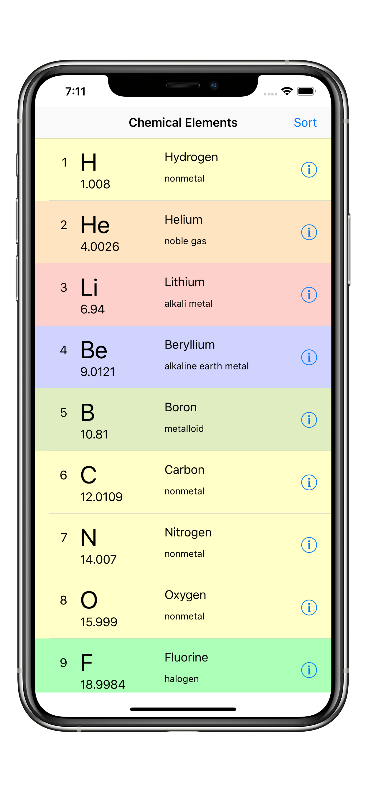
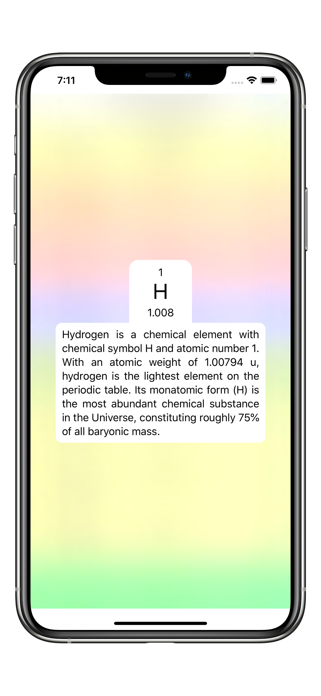
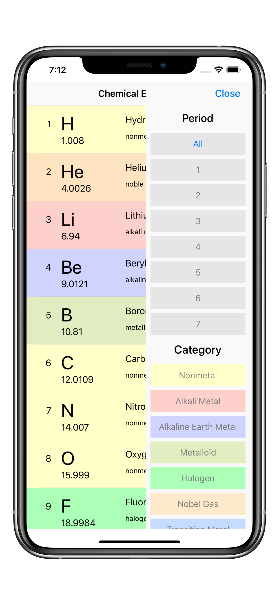
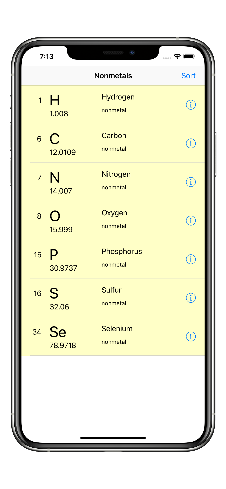
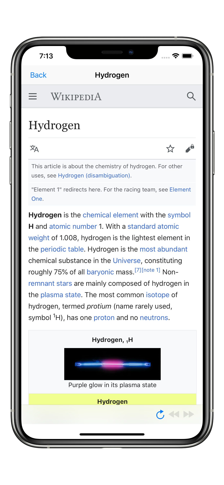

    
       
    

This table of elements gives you basic fundamental information of each element: name, symbol, atomic number, atomic mass, and category, along with some brief facts when clicked.

Ideal for students that need a convenient source for searching element properties or anyone interested in chemistry.

Features include:

A brief summary of the element when it is clicked.
Quick access to each element’s Wikipedia page showing in-depth information.
Sort button to filter by period 1-7, or category, such as:
* Nonmetal
* Alkali Metal
* Alkaline Earth Metal
* Metalloid
* Halogen
* Nobel Gas
* Transition Metal
* Post-transition Metal
* Lanthanide
* Actinide

## Screenshots

